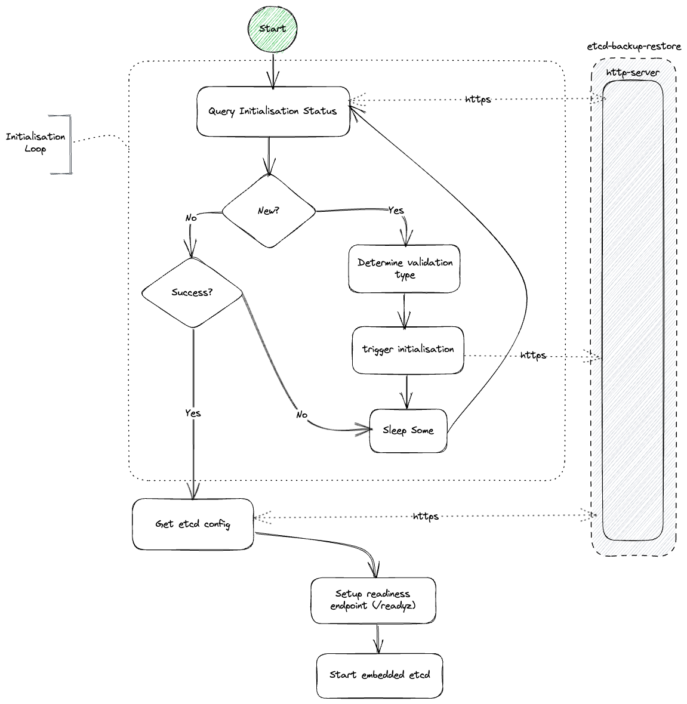

# Etcd bootstrap

## Overview

The purpose of this document is to explain the start-up and shutdown-down phases of etcd-wrapper.

> Etcd-wrapper is not designed to run as a stand-alone application, but in tandem with [etcd-backup-restore](https://github.com/gardener/etcd-backup-restore) which runs as a sidecar. This sidecar performs operations to support etcd such as data directory validation, optional restoration, etcd configuration provider, regular database defragmentation, automatic backups, etc.

## Lifecycle

The following is the detailed lifecycle of etcd-wrapper. The workings of etcd-backup-restore are not explained in detailed and only briefly mentioned in order to explain etcd-wrapper lifecycle. Please refer to [etcd-backup-restore](https://github.com/gardener/etcd-backup-restore) for more details.

### Bootstrapping phase

This is the description of the process to setup and start etcd properly. It is in the bootstrapping phase that `etcd-wrapper` interacts with its sidecar (`etcd-backup-restore`). 

#### Setup: Initialisation Loop

**Step #1**

The loop starts with querying the `etcd-backup-restore` container if an initialisation has already been started. 

* If no initialisation has been started then the HTTPS response will contain `New` state indicating that `etcd-backup-restore` has not yet received a request for initialisation yet.

* If an initialisation has already been triggered then the response will contain one of `Progress`  | `Success` | `Failed`

**Step #2**

If initialisation status is `New` then it does the following:

* It tries to determine what is the validation mode with which a new initialisation should be triggered. Two validation modes are supported at present - `sanity` and `full`. An appropriate validation mode is selected based on the last captured `exit-code` of `etcd-wrapper`. If there was a graceful termination then it opts for `sanity` checks of etcd data directory only. In all other cases (no exit-code captured or non-graceful termination exit-code), it opts for `full` validation of the etcd data directory.

* Triggers initiliasation with the selected `validation-mode` to `etcd-backup-restore` container/process.

* It sleeps for some time to prevent a busy loop and goes back to Step-1.

> For more details about the validation modes check [here](https://github.com/gardener/etcd-backup-restore/blob/master/docs/proposals/validation.md).

If initiliasation is either `Progress` or `Failed` it will sleep for some time to prevent busy loop and then goes back to Step-1 

**Exit condition**

Initiliasation loop exits only when the status returned from `etcd-backup-sidecar` is `Success`.  After exiting the initialisation loop, etcd configuration is fetched from `etcd-backup-restore`.

#### Start Etcd

Start phase mainly comprises of two steps:

1. Set up a readiness probe at `/readyz` where anyone can query to verify if the etcd application(single node cluster or multi-node cluster) is ready to accept client traffic.

2. Start an embedded etcd using the fetched etcd configuration.

### Terminating phase

`etcd-wrapper` can either terminate gracefully or un-gracefully (panics). In either of these cases an attempt is made to capture the exit code.  In case of a graceful termination application context is cancelled which gracefully terminates all go-routines and releases resources.
